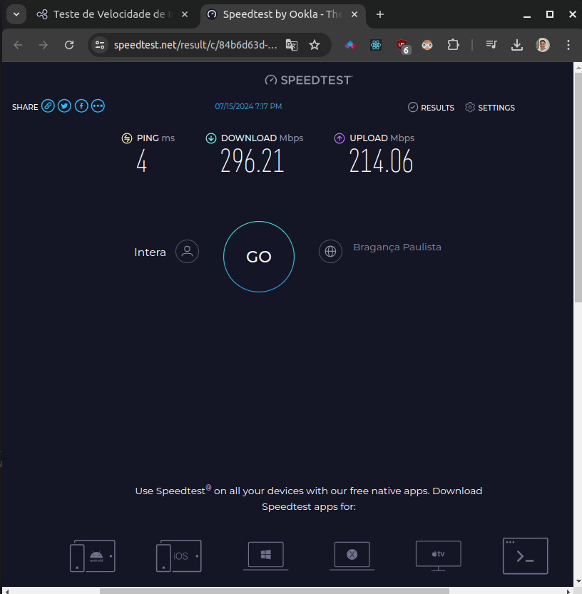

# Teste de Conexão

Este projeto é feito em cima da biblioteca "speedtest-net"

O objetivo é testar a conexão do usuário e exibir o resultado na interface.

### Imagens da aplicação:




### Como rodar o projeto?

Pré-requisitos:
Node v20.13.1
Yarn v1.22.22 or NPM 10.5.2

## Backend

```
yarn
yarn dev
```

## Client/Front

```
yarn
yarn dev
```

Access localhost: http://localhost:5173/
